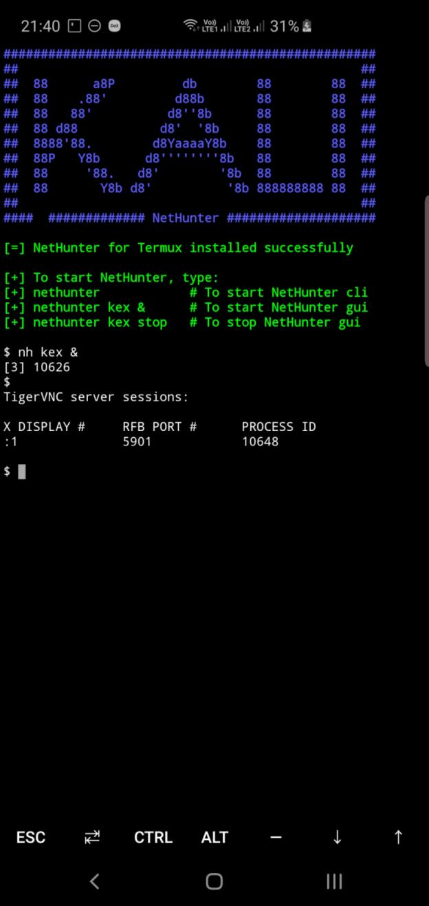
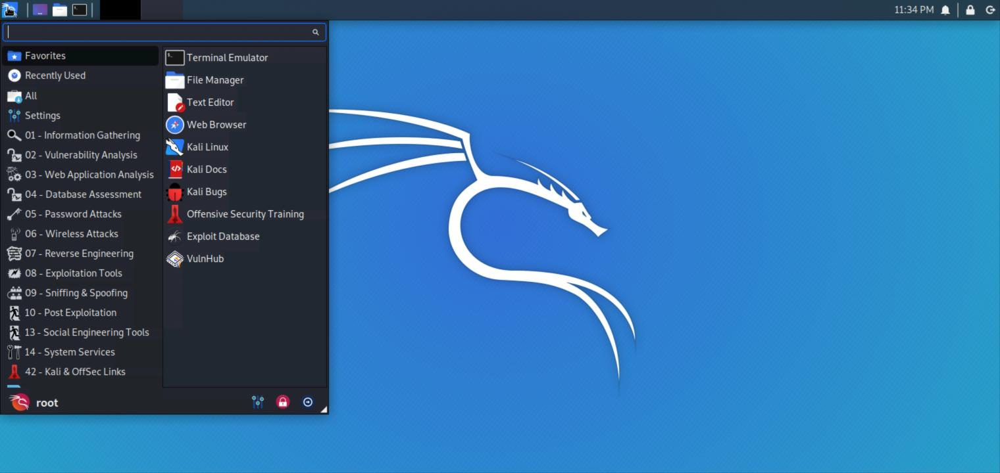

# NetHunter - Mobile Penetration Testing Platform   
# _Rootless Editions_         

## A project by Offensive Security  

### NetHunter Termux Edition  

Prerequisite:  
--------------  
Android Device  
(Stock unmodified device, no root or custom recovery required)  

  

Installation:  
--------------  
Install nethunter-store app from https://store.nethunter.com  
From nethunter store, install termux and NetHunter-KeX client  
Open termux  
`termux-setup-storage`  
`wget https://gitlab.com/kalilinux/nethunter/build-scripts/kali-nethunter-project/raw/2020.1/nethunter-rootless/install-nethunter-termux`  
`chmod +x install-nethunter-termux`  
`./install-nethunter-termux`  

Usage:  
-------  
Open termux and type one of the following:  

| Command              | To                                          |
| -------------------- | ------------------------------------------- |
| `nethunter`          | start Kali NetHunter command line interface |
| `nethunter kex &`    | start Kali NetHunter Desktop Experience     |
| `nethunter kex stop` | stopKali NetHunter Desktop Experience       |

Note: The command `nethunter` can be abbreviated to `nh`.

For KeX, start KeX client, enter password and click connect  
